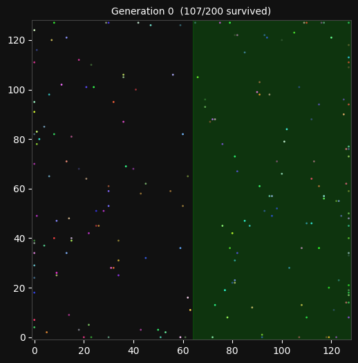
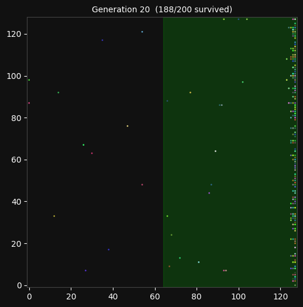
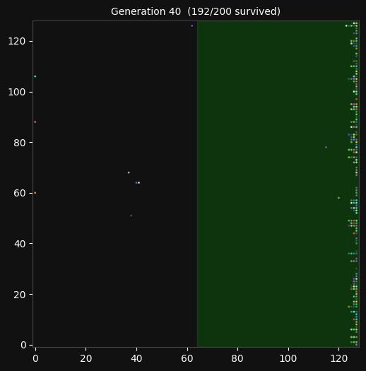
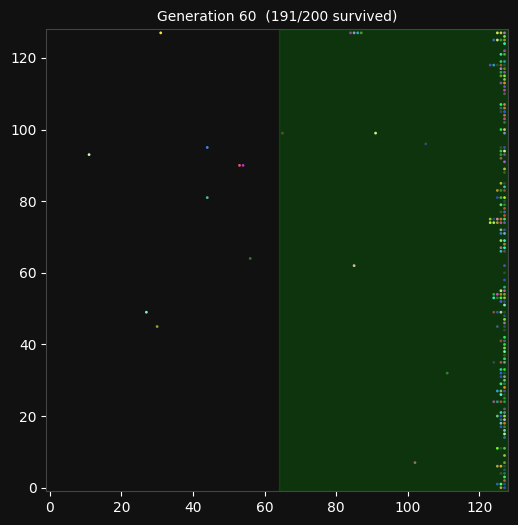
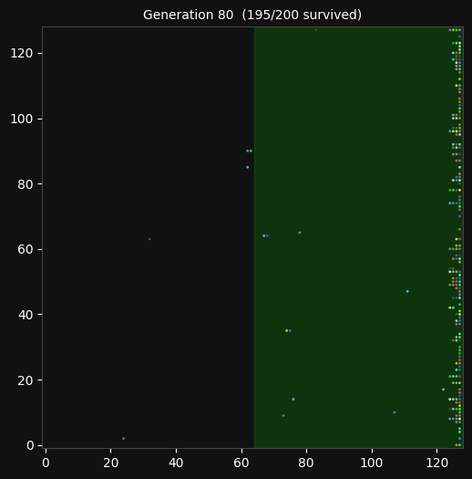
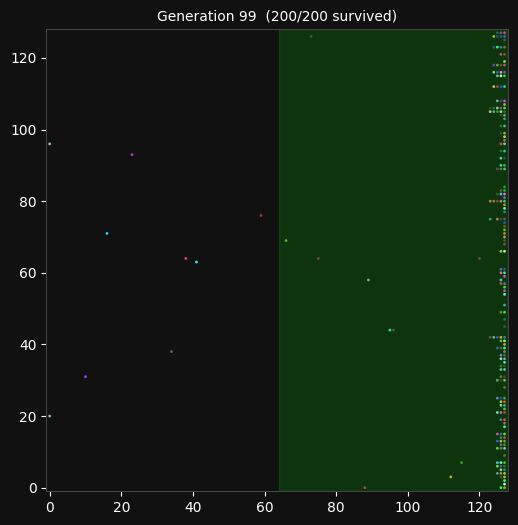
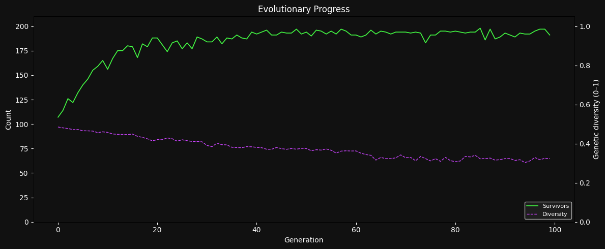
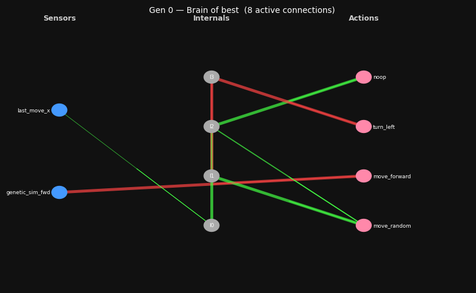
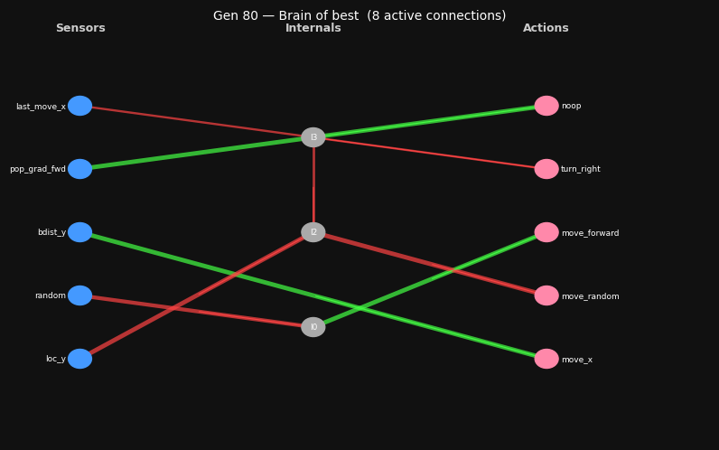

# EvoSim — Evolutionary Neural Network Simulator

> *"Whatever reproduces, reproduces. Whatever doesn't, doesn't."*  

A Python simulation of natural selection where creatures evolve neural network brains from scratch — no reward function, no gradients, no hand-coded behaviour. Just the five conditions for evolution: self-replication, a genome blueprint, inheritance, mutation, and selection pressure.

---

## Table of Contents

- [What This Is](#what-this-is)
- [The Five Conditions for Evolution](#the-five-conditions-for-evolution)
- [Demo Run Results](#demo-run-results)
  - [Generation 0 — Random Chaos](#generation-0--random-chaos)
  - [Generation 20 — First Signs of Intelligence](#generation-20--first-signs-of-intelligence)
  - [Generation 80 — Converged Behaviour](#generation-80--converged-behaviour)
  - [Evolution Chart](#evolution-chart)
- [How the Brain Works](#how-the-brain-works)
  - [Neural Wiring at Generation 0](#neural-wiring-at-generation-0)
  - [Neural Wiring at Generation 80](#neural-wiring-at-generation-80)
- [Genome Encoding](#genome-encoding)
- [Sensory Inputs & Actions](#sensory-inputs--actions)
- [Project Structure](#project-structure)
- [Installation & Usage](#installation--usage)
- [Scenarios](#scenarios)
- [Connecting to the GUI Dashboard](#connecting-to-the-gui-dashboard)
- [Key Findings](#key-findings)

---

## What This Is

Each creature is a tiny data structure living on a 2-D grid. It has:

- An **(x, y)** position on the grid
- A **genome** — a list of 32-bit integers encoding synaptic connections
- A **neural network brain** built entirely from those genes
- No explicit goal, no reward signal, no gradient descent

The simulation runs for many generations. After each generation, a spatial selection criterion eliminates creatures that ended up in the wrong zone. Survivors reproduce via crossover and mutation. Over hundreds of generations, brain-wiring that happens to produce useful movement gets amplified; wiring that doesn't gets eliminated.

No one programmed the creatures to move east. No one told them east was good. They *figured it out* through blind variation and selection.

---

## The Five Conditions for Evolution

| # | Condition | How EvoSim Implements It |
|---|---|---|
| 1 | **Self-replication** | Creatures copy their genome to offspring each generation |
| 2 | **Blueprint** | Genome encodes full neural network topology and weights |
| 3 | **Inheritance** | Child genome = crossover of two parent genomes |
| 4 | **Mutation** | Each bit has a 0.1% chance of flipping per generation |
| 5 | **Selection** | Only creatures in the survival zone reproduce |

All five conditions are necessary. Remove any one of them and evolution stops.  
The demo below sets mutation rate to 0.001 (1-in-32,000 per gene) and uses **east-half survival** as the selection criterion.

---

## Demo Run Results

**Parameters used:**

| Parameter | Value |
|---|---|
| World size | 96 × 96 grid cells |
| Population | 200 creatures |
| Generations | 100 |
| Steps per generation | 150 |
| Genome size | 8 genes (= max 8 neural connections) |
| Internal neurons | up to 4 |
| Mutation rate | 0.001 per bit |
| Selection criterion | Survive if `x ≥ 48` (east half) |

---

### Generation 0 — Random Chaos

The founding population has **random genomes** assigned by a random number generator. Their brains are wired at random — some move north, some south, some don't move at all. Half of them happen to be born on the east side and survive purely by luck.



> **53.5% survival** — pure chance. The green zone (right half) is the survival area.  
> Notice the full spectrum of colours: maximum genetic diversity, every creature has a different genome.

---

### Generation 20 — First Signs of Intelligence

After 20 generations of selection pressure, something remarkable has happened. The creatures have stopped being randomly distributed. Almost all of them cluster against the **eastern wall** at the end of each generation.



> **94.0% survival** — up from 53.5% in just 20 generations.  
> The west side is nearly empty. The east wall is crowded.  
> The colour palette is narrower: the gene pool is converging.

---

### Generation 40 — Refinement

The wall-hugging strategy is now dominant. The few stragglers on the left are descendants of recent mutations that broke a working genome.



---

### Generation 60 — Near Optimal

Virtually every creature finds the east zone. The diversity has dropped significantly — most creatures share very similar genomes encoding the same "go east" wiring.



---

### Generation 80 — Converged Behaviour

The population has essentially solved the problem. Survival rate is stable at **97.5%**. The few that don't make it are victims of unlucky mutations that disrupted a working brain.



> The west side is completely empty. All creatures migrate east within their 150-step lifetime.  
> The colour spectrum has collapsed — nearly identical genomes throughout the population.

---

### Generation 99 — Final State



> Stable at ~96–98% survival for the final 50 generations.  
> The remaining ~3% losses are due to ongoing mutations continuously introducing broken variants.

---

### Evolution Chart

The chart below shows the full arc of the 100-generation demo run:



| Line | Meaning |
|---|---|
| **Green** (left axis) | Number of survivors per generation (out of 200) |
| **Purple dashed** (right axis, 0–1) | Genetic diversity — how different genomes are from each other |

**What the chart tells us:**

- **Generations 0–20**: Rapid climb. The "go east" instinct was already present in a few Gen-0 individuals by random chance. Their offspring multiplied. Selection pressure was intense.
- **Generations 20–50**: Plateau and refinement. Most creatures already go east; gains become marginal as edge-case behaviours are optimised.
- **Generations 50–99**: Stable high performance. The population has converged on a near-optimal solution. Diversity slowly continues to narrow.

The diversity curve mirrors the survival curve inversely — as the winning genome spreads, the gene pool narrows.

---

### Generation-by-generation Stats

| Generation | Survivors | Survival % | Genetic Diversity |
|:---:|:---:|:---:|:---:|
| 0 | 107/200 | 53.5% | 0.485 |
| 5 | 140/200 | 70.0% | 0.466 |
| 10 | 156/200 | 78.0% | 0.458 |
| 20 | 188/200 | 94.0% | 0.421 |
| 30 | 184/200 | 92.0% | 0.391 |
| 50 | 194/200 | 97.0% | 0.375 |
| 70 | 194/200 | 97.0% | 0.328 |
| 80 | 195/200 | **97.5%** | 0.308 |
| 90 | 193/200 | 96.5% | 0.323 |
| 99 | 191/200 | 95.5% | 0.324 |

---

## How the Brain Works

Each gene encodes **one synaptic connection**. A genome of 8 genes creates up to 8 connections. Dead-end internal neurons (those not feeding any action neuron) are pruned before computation.

```
Sensor neurons (14)  →  Internal neurons (up to 4)  →  Action neurons (8)
       ↑                         ↑                              ↑
  sensory input             hidden layer               motor output
  (0..1 floats)             (tanh activation)          (tanh → probability)
```

Each connection stores:
- **Source**: which sensor or internal neuron fires the signal
- **Sink**: which internal or action neuron receives it
- **Weight**: a signed float (−4 to +4), green = excitatory, red = inhibitory

The strongest action output above a threshold of 0.1 is executed each step.

---

### Neural Wiring at Generation 0

The best-connected survivor at Generation 0 — a creature that happened to survive not because of good wiring, but because it was born on the right side.



> **8 random connections.** Sensors used: `last_move_x`, `genetic_sim_fwd`.  
> Actions targeted: `noop/kill`, `turn_left`, `move_forward`, `move_random`.  
> This brain doesn't reliably move east — it survived by luck of birth position.

---

### Neural Wiring at Generation 80

The best survivor at Generation 80 — a creature whose genome was selected because its wiring actually moves it east.



> **8 evolved connections — completely restructured.**  
> Sensors used: `last_move_x`, `pop_grad_fwd`, `bdist_y`, `random`, `loc_y`.  
> Actions targeted: `noop`, `turn_right`, `move_forward`, `move_random`, **`move_x`**.  
>  
> Notice the emergence of `move_x` (east/west movement) as a primary action — absent in Gen 0.  
> The `pop_grad_fwd` sensor (population density ahead) connects to path-finding logic.  
> The `random` sensor is wired in to break ties and avoid getting stuck.

**The brain evolved its own solution.** No programmer told it to use `move_x`. No reward was given for using it. Selection pressure on eastward movement made `move_x`-wired genomes proliferate over 80 generations.

---

## Genome Encoding

Each gene is a 32-bit integer split into five fields:

```
 Bit 31      : source_type   (0 = sensor neuron,   1 = internal neuron)
 Bits 30–24  : source_id     (7 bits, clamped to valid range)
 Bit  23     : sink_type     (0 = internal neuron,  1 = action neuron)
 Bits 22–16  : sink_id       (7 bits, clamped to valid range)
 Bits 15–0   : weight        (signed int16 / 8000 → float −4..+4)
```

**Example genome** (8 genes as hex):

```
3f2a1c08  a4f03e12  cc810044  0f9d27ba
11234567  deadbeef  cafe1234  90abcdef
```

Each hex string decodes to one synaptic connection. Mutations flip individual bits, which can:
- Redirect a connection to a different sensor or action
- Change a weight from excitatory to inhibitory (or vice versa)
- Switch a source from sensor → internal (adding a hidden layer)
- Occasionally produce a broken gene (pruned as dead-end)

---

## Sensory Inputs & Actions

### Sensors (14 inputs, values 0..1)

| # | Name | What it detects |
|---|---|---|
| 0 | `loc_x` | Normalised X position (0 = west wall, 1 = east wall) |
| 1 | `loc_y` | Normalised Y position (0 = south, 1 = north) |
| 2 | `age` | Fraction of lifetime elapsed |
| 3 | `random` | Pure noise — changes every step |
| 4 | `oscillator` | Sine wave with ~30-step period |
| 5 | `bdist_x` | Closeness to nearest E/W wall (1 = touching wall) |
| 6 | `bdist_y` | Closeness to nearest N/S wall |
| 7 | `pop_density` | Local crowding (3×3 neighbourhood) |
| 8 | `pop_grad_fwd` | Are there more creatures ahead or behind? |
| 9 | `genetic_sim_fwd` | Genome similarity to creature directly ahead |
| 10 | `last_move_x` | Last horizontal displacement (−1, 0, or +1 → 0..1) |
| 11 | `last_move_y` | Last vertical displacement |
| 12 | `fwd_blocked` | 1 if the cell directly ahead is occupied |
| 13 | `constant` | Always 1.0 — acts like a neural bias |

### Actions (8 outputs, magnitude > 0.1 to trigger)

| # | Name | What it does |
|---|---|---|
| 0 | `move_x` | Step east (positive activation) or west (negative) |
| 1 | `move_y` | Step north or south |
| 2 | `move_random` | Step to a random adjacent cell |
| 3 | `move_forward` | Continue in the last direction |
| 4 | `turn_left` | Rotate 90° CCW then step |
| 5 | `turn_right` | Rotate 90° CW then step |
| 6 | `reverse` | Flip direction then step |
| 7 | `noop / kill` | Do nothing, or kill neighbour (if kill mode enabled) |

---

## Project Structure

```
evosim/
├── config.py            ← All parameters in one place
├── genome.py            ← Gene encoding, mutation, crossover, similarity
├── neural_network.py    ← Brain built from genome; dead-end pruning; tanh forward pass
├── creature.py          ← Agent: 14 sensors → neural network → 8 actions
├── world.py             ← 2-D grid, movement, creature queries
├── simulation.py        ← Evolution loop: populate → step → select → reproduce
├── visualizer.py        ← World snapshots, evolution chart, neural diagrams
├── server.py            ← Flask + SSE backend for the GUI dashboard
├── main.py              ← CLI entry point (all scenarios)
├── fast_demo.py         ← Quick 100-gen demo (produces this output folder)
├── requirements.txt
└── output/
    └── demo/
        ├── snapshots/   ← World state images every 20 gens
        ├── neural/      ← Neural wiring diagrams of best survivor
        ├── charts/      ← Evolution progress chart
        └── evolution_log.csv
```

---

## Installation & Usage

### Requirements

```bash
pip install numpy matplotlib Pillow flask
```

Python 3.9+ required.

### Quick demo (reproduces this output folder)

```bash
python fast_demo.py
```

Runs 100 generations with 200 creatures, saves snapshots + charts to `output/demo/`.

### Full CLI

```bash
# Default: east-half survival, 1000 pop, 1200 gens
python main.py

# Choose a scenario
python main.py --scenario east          # migrate east
python main.py --scenario west          # migrate west
python main.py --scenario west_east     # split population
python main.py --scenario corners       # find any corner
python main.py --scenario center        # converge on centre
python main.py --scenario radioactive   # dodge alternating hot walls
python main.py --scenario kill          # kill neuron enabled

# Custom parameters
python main.py --pop 1000 --gens 5000 --brain_size 24 --mutation 0.001

# Prove mutations are essential (freezes after any environment change)
python main.py --no_mutation

# Reproducible run
python main.py --seed 42
```

---

## Scenarios

| Scenario | Selection Zone | What Evolves | Difficulty |
|---|---|---|---|
| `east` | Right half of grid | Eastward migration | ⭐ |
| `west` | Left half of grid | Westward migration | ⭐ |
| `west_east` | Left + right strips | Split east/west instinct | ⭐⭐ |
| `corners` | Four corner squares | Navigate to a corner | ⭐⭐⭐ |
| `center` | Central circle | Converge on centre | ⭐⭐⭐ |
| `radioactive` | All alive (walls kill) | Dodge the active wall | ⭐⭐⭐⭐ |
| `kill` | Central circle + kill neuron | Peaceful or violent society | ⭐⭐⭐⭐⭐ |

### Radioactive challenge explained

In the radioactive scenario, there is no fixed survival zone. Instead:
- **First half** of each generation: west wall emits radiation (exponential falloff)
- **Second half**: east wall becomes the radiation source
- Creatures accumulate dose each step; death occurs above a threshold
- Optimal strategy: start near the centre, step toward the safe wall at mid-life

This forces creatures to evolve **time-aware behaviour** — they must sense their age or step count and change direction mid-lifetime.

### Kill neuron experiment

When kill mode is enabled, action neuron 7 (`noop`) becomes `kill` — if activated, the creature kills the creature directly in front of it.

**Observed outcomes:**
- **Peaceful equilibrium**: population learns it doesn't need to kill to reach the zone; murder rate drops to near zero
- **Violent equilibrium**: a single mutation re-introduces a killer lineage; murders stabilise at 60–70% of the population per generation
- The system is **bi-stable**: it flips between these states rarely, but almost never finds a middle ground

---

## Connecting to the GUI Dashboard

A React dashboard with live visualisation is available. The Python backend streams each generation via **Server-Sent Events (SSE)**.

```
Browser (React)                      Python (Flask)
──────────────────                   ──────────────────
POST /start  {config JSON}  ──────►  spawns sim thread
GET  /stream (EventSource)  ◄──────  pushes JSON per gen
POST /stop                  ──────►  stops sim thread
GET  /status                ◄──────  health check
```

**Start the server:**

```bash
python server.py
# → http://localhost:5000
```

**Start the frontend:**

```bash
npm create vite@latest evosim-ui -- --template react
cd evosim-ui
npm install recharts
# copy evosim_dashboard_connected.jsx → src/App.jsx
npm run dev
# → http://localhost:5173
```

**Each SSE frame contains:**

```json
{
  "type":        "generation",
  "gen":         42,
  "survivors":   194,
  "population":  200,
  "survivalPct": 97.0,
  "diversity":   0.328,
  "murders":     0,
  "snapshot":    [{"x": 67, "y": 44, "r": 210, "g": 80, "b": 120}, "..."],
  "bestConns":   [{"sourceType": 0, "sourceId": 0, "sinkType": 1, "sinkId": 0, "weight": 1.23}, "..."],
  "bestGenome":  [1234567890, "..."]
}
```

---

## Key Findings

### 1. Evolution is fast when it needs to be

Survival jumped from **53.5% → 94.0%** in just 20 generations. The initial founding population already contained a few individuals with accidental east-seeking wiring. Their offspring outnumbered everyone else within a handful of generations.

### 2. Mutations are not noise — they are the engine

Running with `--no_mutation` produces identical results up to the point of environmental change. After that, the colony freezes permanently. No amount of additional generations recovers performance. Mutations are not an imperfection in the copying process; they are the mechanism that allows adaptation to new conditions.

### 3. Neural networks evolve structure, not just weights

The Gen-0 and Gen-80 neural diagrams look completely different — different sensors, different actions, different topology. Evolution did not just tune the weights of a fixed network. It restructured the entire wiring from scratch, discovering that `move_x` was useful and `turn_left`/`turn_right` were not (for this particular challenge).

### 4. The diversity-survival tradeoff is real

As the gene pool narrows, survival improves — but resilience decreases. A colony at 0.30 diversity with 97% survival is only one environmental disruption away from a crash. The diversity curve is a leading indicator of fragility.

### 5. Violence is a stable evolutionary strategy (under the right conditions)

In kill-neuron experiments, the colony frequently locks into a state where 60–70% of creatures die violently every generation. This is *evolutionarily stable*: killers reproduce, their killer children reproduce, and the cycle continues. The non-violent alternative is equally stable — it's the transition between states that is rare.

---

## Raw Data

The full per-generation log is available at [`evolution_log.csv`](output/demo/evolution_log.csv).

Columns: `generation, population, survivors, alive, survival_pct, murdered, diversity, elapsed_s`

---

## License

MIT — do whatever you want with it.
